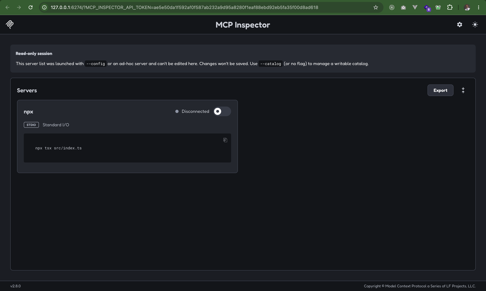
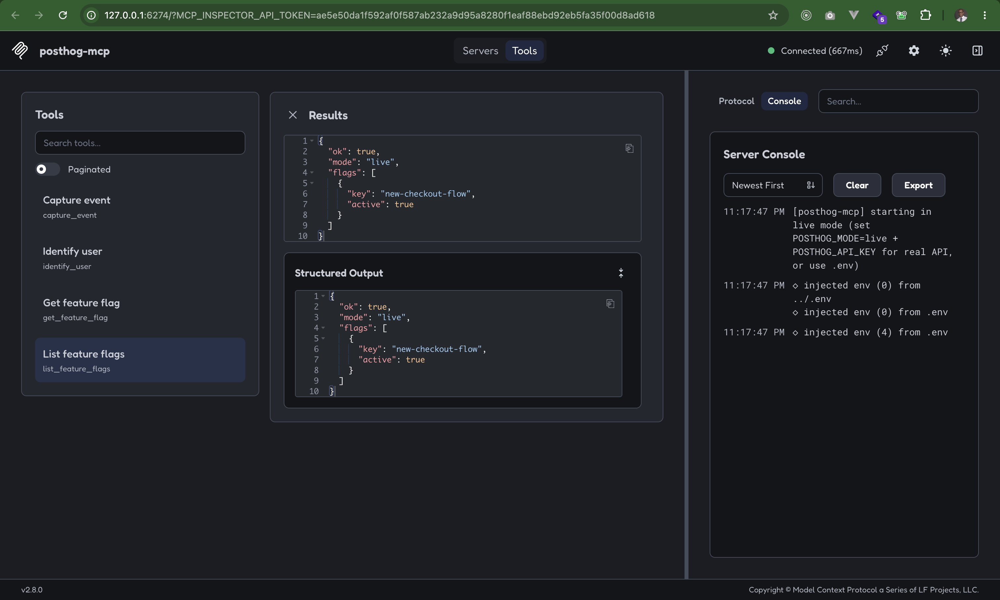

# posthog-mcp

MCP server that gives agents a tiny PostHog surface: capture events, identify users, and read feature flags.

**Mock mode is the default** — no API key required. Set `POSTHOG_MODE=live` + `POSTHOG_API_KEY` (in a `.env` file or your shell) to hit a real project. Credentials alone never flip to live; you must opt in with `POSTHOG_MODE=live`.

## Why agents use this

Agents need tools they can call, not dashboards they can screenshot. This repo is a runnable slice of that: an MCP server with clear tool schemas, machine-readable docs (`AGENT.md`, `llms.txt`), and an eval harness that proves the tools behave.

## Tools (4)

| Tool | Purpose |
|------|---------|
| `capture_event` | Capture an analytics event for a `distinctId` |
| `identify_user` | `$set` person properties on a `distinctId` |
| `get_feature_flag` | Evaluate a flag for a user (boolean / multivariate / null) |
| `list_feature_flags` | List known flags (seeded in mock; live needs personal API key) |

Mock seeded flags: `new-onboarding=true`, `beta-insights=false`, `pricing-experiment="control"`.

## Run locally

```bash
npm install
npm run eval          # MCP in-memory evals (happy + failure paths)
npm run dev           # stdio MCP server (for Cursor / Claude / Inspector)
```

The server logs its mode to stderr on startup, e.g. `[posthog-mcp] starting in mock mode`.

### Configuration (`.env`)

Environment variables are loaded with [`dotenv`](https://www.npmjs.com/package/dotenv) from a `.env` file in the project root (resolved relative to the entry file, so it works from `src/` via tsx and from `dist/src/` after a build), then from the current working directory. Variables already set in your shell or MCP config take precedence over `.env`.

Create `.env` in the project root:

```bash
POSTHOG_MODE=mock                           # mock (default) | live
POSTHOG_API_KEY=phc_xxx                     # project API key — required for live
POSTHOG_HOST=https://us.i.posthog.com       # or https://eu.i.posthog.com
POSTHOG_PERSONAL_API_KEY=phx_xxx            # optional — needed for list_feature_flags in live mode
```

| Variable | Default | Notes |
|----------|---------|-------|
| `POSTHOG_MODE` | `mock` | `live` enables real network calls |
| `POSTHOG_API_KEY` | — | Project API key (`phc_...`) |
| `POSTHOG_HOST` | `https://us.i.posthog.com` | Use `https://eu.i.posthog.com` for EU Cloud |
| `POSTHOG_PERSONAL_API_KEY` | — | Personal API key (`phx_...`), only for `list_feature_flags` in live mode |

`.env` and `.env.*` are git-ignored — never commit real keys.

### MCP Inspector

```bash
npx @modelcontextprotocol/inspector -- npx tsx src/index.ts
```

Opens a browser UI where you can list and call the tools interactively. It picks up your `.env` automatically.

The server appears as a stdio entry running `npx tsx src/index.ts` — toggle it on to connect:



Once connected, the **Tools** tab lists all four tools. Here `list_feature_flags` is called in live mode; the Server Console on the right shows the startup log and `.env` being loaded:



### Cursor / Claude Desktop MCP config

```json
{
  "mcpServers": {
    "posthog": {
      "command": "npx",
      "args": ["tsx", "src/index.ts"],
      "cwd": "/absolute/path/to/posthog-mcp",
      "env": {
        "POSTHOG_MODE": "mock"
      }
    }
  }
}
```

Or after `npm run build`: `"command": "node", "args": ["dist/src/index.js"]`.

The `env` block is optional — if you omit it, the server falls back to your project `.env`. Values set in `env` override `.env`.

### Live PostHog (optional)

Set `POSTHOG_MODE=live` and your keys in `.env` (see above), then:

```bash
npm run dev
```

Or export them in your shell instead:

```bash
export POSTHOG_MODE=live
export POSTHOG_API_KEY=phc_xxx
export POSTHOG_HOST=https://us.i.posthog.com   # or https://eu.i.posthog.com
export POSTHOG_PERSONAL_API_KEY=phx_xxx        # optional, for list_feature_flags
npm run dev
```

## Machine docs

- [`AGENT.md`](./AGENT.md) — how an agent should call these tools
- [`llms.txt`](./llms.txt) — compact capability index for LLM crawlers / routers

## Scripts

| Script | What it does |
|--------|----------------|
| `npm run dev` | Start stdio MCP server via tsx |
| `npm run build` | Compile TypeScript to `dist/` |
| `npm start` | Run compiled `dist/src/index.js` |
| `npm run eval` / `npm test` | Run the MCP eval harness |
| `npm run typecheck` | Type-check without emitting |

## Layout

```
.env                  # local config (git-ignored)
src/index.ts          # stdio entry (loads .env, picks mock/live)
src/server.ts         # MCP tool registration
src/posthog/          # mock + live clients
eval/harness.ts       # in-memory MCP client↔server evals
docs/images/          # README screenshots
AGENT.md / llms.txt   # docs for machines
```

## License

MIT
